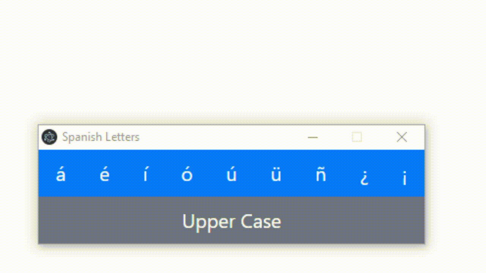

# slingo
## an intuitive interface for spanish-specific letters

## Usage

Just click the letter you want and it will be copied to your clipboard. Paste the "spanish letter" wherever you need it. 

## Contributing to slingo *(I can't do this all by myself)*

1. Fork this repository.
2. Create a branch: `git checkout -b <branch_name>`.
3. Make your changes and commit them: `git commit -m '<commit_message>'`
4. Push to the original branch: `git push origin <project_name>/<location>`
5. Create the pull request.

Alternatively see the GitHub documentation on [creating a pull request](https://help.github.com/en/github/collaborating-with-issues-and-pull-requests/creating-a-pull-request).